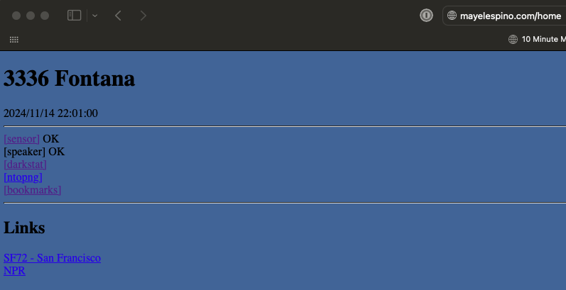
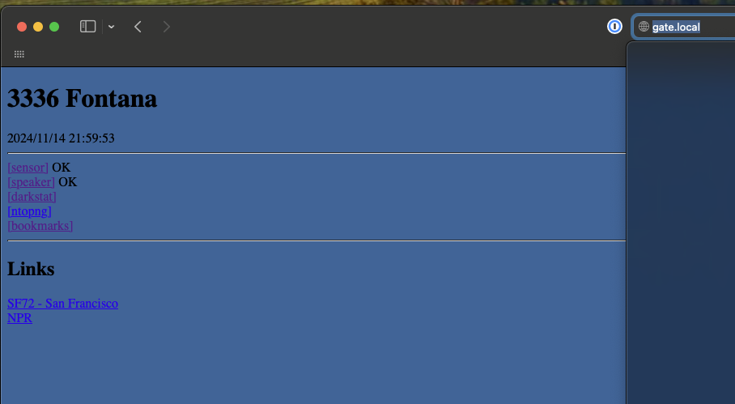
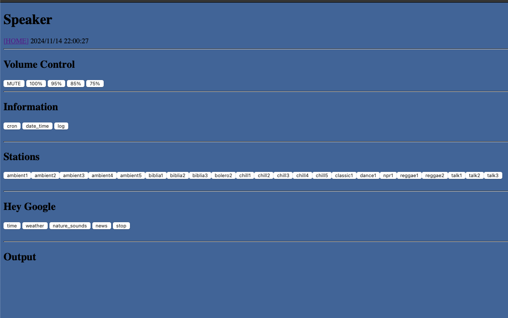
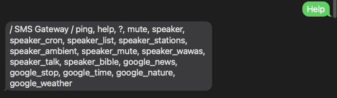
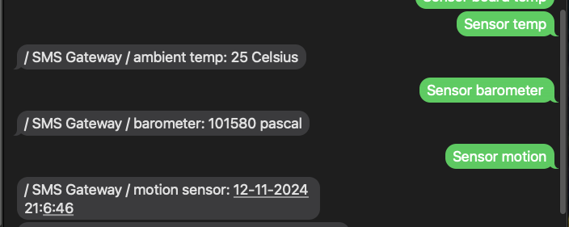

# gate-pi

## WWW Gateway

If NOT accessed from within my network, the link to the speaker is **disabled**: [http://mayelespino.com/home](http://mayelespino.com/home)

The "OK" next to the Speaker and the Monitor links indicate that these raspberry pies, and the corresponding services, are up and running.

The "darkstat" link takes you to a monitor service running on one of the pies in my home lab.

The "ntopng" link takes you to another monitor service running on one of the pies in my home lab.

The "bookmarks" link take you to the bookmarks management service, running on one of the pies in my home lab.

If accessed from within my network, the link to the speaker is __enabled__: [http://gate.local](http://gate.local)

When the speaker link is accessible this is the page you will see:

## SMS Gateway

This is another service that is based on SMS messages which are received as emails. I have a special email account for this. The responses are sent emails and the provider turns them into SMS messages. So I can use my phone to interact with my services inside my local network.

I can get a list of commands by sending a message : "help":

To see if the service is available, I can send a message: "Ping", the response should be "pong!":

To get information from the sensor, on a respberry pi on my home lab, on my network I can send messages like the following:

Using this service I can interact with my Google assistant in my home lab, sending messages like: 

The sms service will ask the speaker service to say "google stop" (in this example) through the speakers and the google home assistant will respond.

For sms gateway setup information [click here](sms_gate/readme.md)
